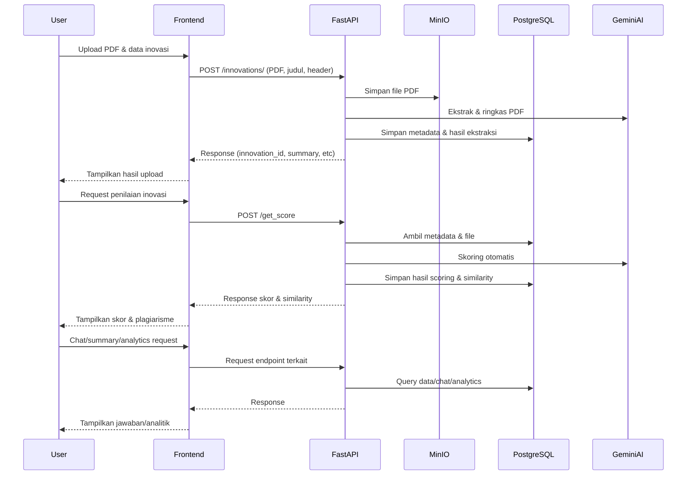

# AI Innovation Checker

AI Innovation Checker adalah platform web modern untuk mengelola, menilai, dan melakukan pengecekan kemiripan (plagiarisme) dokumen inovasi berbasis PDF menggunakan teknologi AI (Google Vertex AI Gemini, LangChain, vektor database, MinIO, dan FastAPI). Sistem ini menyediakan dashboard interaktif, upload PDF, penilaian otomatis, chat AI, analitik, dan fitur chatbot mengambang.

---

## Fitur Utama
- **Upload PDF Inovasi**: User dapat mengunggah dokumen inovasi (PDF) yang akan diekstrak dan dianalisis otomatis.
- **Ekstraksi Otomatis**: Sistem mengekstrak bagian penting (latar belakang, tujuan, deskripsi) dari PDF menggunakan model multimodal.
- **Penyimpanan Aman**: File PDF disimpan di MinIO, metadata di PostgreSQL.
- **Cek Kemiripan (Plagiarisme)**: Menggunakan vektor embedding dan LSA similarity untuk mendeteksi kemiripan antar dokumen.
- **Penilaian Otomatis**: Skoring inovasi berdasarkan komponen yang dapat dikonfigurasi.
- **Chatbot AI**: Chat interaktif dengan AI terkait inovasi, baik per dokumen maupun chatbot mengambang (floating chatbot) di dashboard.
- **Analitik & Ringkasan**: Statistik chat, summary inovasi, dan insight lain.
- **Dashboard Modern**: Frontend React (Vite) dengan sidebar menu, modal detail, PDF preview, toast notifikasi, dan responsif.

---

## Arsitektur
- **Backend**: FastAPI, async, endpoint modular, CORS, logging, MinIO, PostgreSQL, AI (Gemini, LangChain)
- **Frontend**: React (Vite), modular, sidebar menu, floating chatbot, PDF preview, toast, dropdown, responsive CSS
- **Storage**: MinIO (file), PostgreSQL (metadata)

---

## Cara Menjalankan (Local)

### Backend (FastAPI)
1. Pastikan Python 3.10+ terinstall
2. Install dependencies:
   ```bash
   pip install -r requirements.txt
   ```
3. Atur file `.env` sesuai kebutuhan (lihat contoh di repo)
4. Jalankan backend:
   ```bash
   uvicorn main:app --reload
   ```

### Frontend (React)
1. Masuk ke folder `app/`
2. Install dependencies:
   ```bash
   npm install
   ```
3. Jalankan frontend:
   ```bash
   npm run dev
   ```
4. Buka browser ke [http://localhost:5173](http://localhost:5173)

---

## Struktur Folder

- `main.py`            : Entry point FastAPI, seluruh endpoint dan logic backend masih di sini (belum modular)
- `config/`            : Konfigurasi MinIO, Gemini, PostgreSQL
- `module/`            : Modul AI, vektor, ekstraksi PDF
- `app/`               : Frontend React (Vite)
    - `index.tsx`      : Entry point React
    - `index.css`      : Styling modern dashboard & chatbot
    - `index.html`     : HTML utama
    - `package.json`   : Dependensi frontend
    - `README.md`      : Dokumentasi frontend
- `uploads/`           : Folder upload file (otomatis dibuat)
- `.env`               : Konfigurasi environment

---

## API Endpoint Utama & Contoh Penggunaan

### 1. Upload Inovasi
**POST** `/innovations/`

Contoh cURL:
```bash
curl -X 'POST' \
  'http://localhost:8000/innovations/' \
  -H 'accept: application/json' \
  -H 'X-Inovator: user tester' \
  -H 'Content-Type: multipart/form-data' \
  -F 'judul_inovasi=Sistem "Nusantara Eco-Hub": Solusi Cerdas Pengelolaan Sampah Perkotaan Berbasis IoT, AI, dan Gamifikasi' \
  -F 'file=@Sistem _Nusantara Eco-Hub__ Solusi Cerdas Pengelolaan Sampah Perkotaan Berbasis IoT, AI, dan Gamifikasi.pdf;type=application/pdf' \
  -F 'table_name=innovations'
```
Contoh Response:
```json
{
  "status": "success",
  "code": 200,
  "table": "innovations",
  "extracted_sections": {
    "latar_belakang": "✓",
    "tujuan_inovasi": "✗",
    "deskripsi_inovasi": "✓"
  },
  "ai_summary": {
    "ringkasan_singkat": "Sistem ...",
    "masalah_yang_diatasi": "Krisis ...",
    "solusi_yang_ditawarkan": "Implementasi ...",
    "potensi_manfaat": "Peningkatan ...",
    "keunikan_inovasi": "Integrasi ..."
  },
  "innovation_id": "sistem_..._user_tester"
}
```

### 2. Penilaian Inovasi
**POST** `/get_score`

Contoh cURL:
```bash
curl -X 'POST' \
  'http://localhost:8000/get_score' \
  -H 'accept: application/json' \
  -H 'X-Inovator: user tester' \
  -H 'Content-Type: application/x-www-form-urlencoded' \
  -d 'id=773e4160-2961-4f29-8702-7bbf5d1f7765&table_name=innovations'
```
Contoh Response:
```json
{
  "innovation_id": "773e4160-2961-4f29-8702-7bbf5d1f7765",
  "nama_inovasi": "sistem_...",
  "nama_inovator": "user_tester",
  "link_document": "http://localhost:9000/ai-innovation/innovations/773e4160-2961-4f29-8702-7bbf5d1f7765.pdf",
  "component_scores": {
    "substansi_orisinalitas": 13,
    "substansi_urgensi": 9,
    "substansi_kedalaman": 12,
    "analisis_dampak": 13,
    "analisis_kelayakan": 8,
    "analisis_data": 7,
    "sistematika_struktur": 9,
    "sistematika_bahasa": 9,
    "sistematika_referensi": 3
  },
  "total_score": 83,
  "plagiarism_check": [
    {
      "similarity_score": 1,
      "nama_inovasi": "sistem_...",
      "nama_inovator": "user_tester",
      "compared_innovation_description": "Sistem ..."
    }
  ]
}
```

### 3. LSA Similarity
**GET** `/innovations/{id}/lsa_results`

Contoh cURL:
```bash
curl -X 'GET' \
  'http://localhost:8000/innovations/773e4160-2961-4f29-8702-7bbf5d1f7765/lsa_results?table_name=innovations' \
  -H 'accept: application/json'
```
Contoh Response:
```json
{
  "innovation_id": "773e4160-2961-4f29-8702-7bbf5d1f7765",
  "total_similar_documents": 1,
  "lsa_results": [
    {
      "compared_innovation_id": "sistem_...",
      "similarity_score": 1,
      "compared_innovation_description": "Sistem ...",
      "nama_inovator": "user_tester",
      "created_at": "2025-08-01T11:06:36.258387"
    }
  ]
}
```

### 4. Ringkasan AI
**GET** `/innovations/{id}/summary`

Contoh cURL:
```bash
curl -X 'GET' \
  'http://localhost:8000/innovations/sistem_%22nusantara_eco-hub%22%3A_solusi_cerdas_pengelolaan_sampah_perkotaan_berbasis_iot%2C_ai%2C_dan_gamifikasi_user_tester/summary?table_name=innovations' \
  -H 'accept: application/json'
```
Contoh Response:
```json
{
  "innovation_id": "sistem_..._user_tester",
  "nama_inovasi": "sistem_...",
  "nama_inovator": "user_tester",
  "link_document": "http://localhost:9000/ai-innovation/innovations/sistem_..._user_tester.pdf",
  "ai_summary": {
    "ringkasan_singkat": "Sistem ...",
    "masalah_yang_diatasi": "Krisis ...",
    "solusi_yang_ditawarkan": "Sistem ...",
    "potensi_manfaat": "Peningkatan ...",
    "keunikan_inovasi": "Integrasi ..."
  }
}
```

### 5. Chat Inovasi
**POST** `/innovations/{id}/chat`

Contoh cURL:
```bash
curl -X 'POST' \
  'http://localhost:8000/innovations/sistem_%22nusantara_eco-hub%22%3A_solusi_cerdas_pengelolaan_sampah_perkotaan_berbasis_iot%2C_ai%2C_dan_gamifikasi_user_tester/chat' \
  -H 'accept: application/json' \
  -H 'X-Inovator: user_tester' \
  -H 'Content-Type: application/x-www-form-urlencoded' \
  -d 'question=pakah%20ada%20saran%20perbaikan%20yg%20bisa%20dikembangkan%20dari%20inovasi%20saya&table_name=innovations'
```
Contoh Response:
```json
{
  "chat_id": "cf46f82c-eef1-495c-8af9-eead26e4923d",
  "innovation_id": "sistem_..._user_tester",
  "question": "pakah ada saran perbaikan yg bisa dikembangkan dari inovasi saya",
  "answer": "Tentu, berikut adalah beberapa saran ...",
  "timestamp": "2025-08-01T09:45:37.922913",
  "innovation_name": "sistem_..."
}
```

### 6. Ranking Inovasi
**GET** `/get_rank?table_name=innovations`

Contoh cURL:
```bash
curl -X 'GET' \
  'http://localhost:8000/get_rank?table_name=innovations' \
  -H 'accept: application/json'
```
Contoh Response:
```json
{
  "ranking": [
    {
      "innovation_id": "sistem_\"nusantara_eco-hub\":_solusi_cerdas_pengelolaan_sampah_perkotaan_berbasis_iot,_ai,_dan_gamifikasi_user_tester",
      "substansi_orisinalitas": 13,
      "substansi_urgensi": 9,
      "substansi_kedalaman": 14,
      "analisis_dampak": 13,
      "analisis_kelayakan": 8,
      "analisis_data": 7,
      "sistematika_struktur": 9,
      "sistematika_bahasa": 9,
      "sistematika_referensi": 4,
      "total_score": 86,
      "created_at": "2025-08-01T10:02:12.921681"
    },
    // ...
  ],
  "total": 7
}
```

### 7. Pencarian Inovasi Serupa
**POST** `/search_inovasi`

Contoh cURL:
```bash
curl -X 'POST' \
  'http://localhost:8000/search_inovasi' \
  -H 'accept: application/json' \
  -H 'X-Inovator: user test' \
  -H 'Content-Type: application/x-www-form-urlencoded' \
  -d 'query=saya%20ingin%20mengetahui%20apakah%20ada%20inovasi%20yg%20memanfaatkan%20iot&table_name=innovations'
```
Contoh Response:
```json
{
  "query": "saya ingin mengetahui apakah ada inovasi yg memanfaatkan iot",
  "top_innovation": {
    "id": "fe361b37-138a-499a-bfe4-5bcb79f8ae75",
    "nama_inovasi": "pemanfaatan_kecerdasan_buatan_dan_internet_of_things_untuk_pertanian_presisi_berkelanjutan_di_indonesia",
    "nama_inovator": "ryza",
    "latar_belakang": "Sebagai negara agraris, Indonesia ...",
    "tujuan_inovasi": "Tujuan dari penulisan makalah ini adalah ...",
    "deskripsi_inovasi": "Agri-Synth adalah sebuah ekosistem teknologi ...",
    "link_document": "http://localhost:9000/ai-innovation/innovations/fe361b37-138a-499a-bfe4-5bcb79f8ae75.pdf",
    "similarity": 0.7259951526999864
  },
  "ai_explanation": "Bayangkan sebuah sistem pintar untuk membantu petani ...",
  "results": [ /* ...list hasil similarity... */ ]
}
```

---

### Diagram Alur Proses (Mermaid)



---

